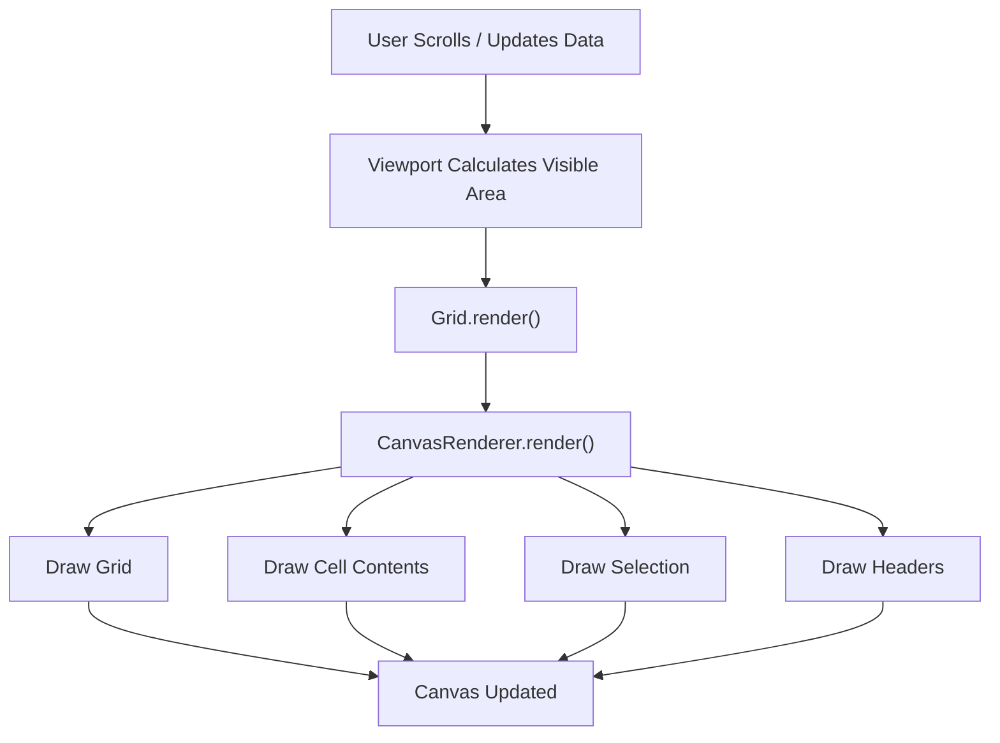
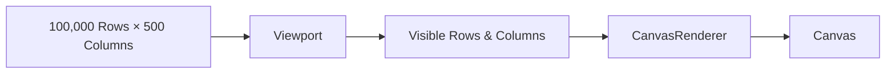

# Excel Grid View
 
A high-performance Excel-like Grid View built using **TypeScript**, **HTML5 Canvas**, **HTML**, and **CSS** following **Object-Oriented Programming (OOP)** principles, **SOLID Design Principles**, and the **Command Pattern**.
 
The project renders an Excel-style spreadsheet capable of handling **100,000 rows** and **500 columns** efficiently using **virtual rendering**, ensuring smooth performance even with large datasets.
 
---
 
# Project Objective
 
The objective of this project is to build an Excel-like spreadsheet from scratch without relying on HTML tables.
 
Instead, the application uses **HTML Canvas** to render only the visible portion of the sheet, making it scalable for large datasets while maintaining good rendering performance.
 
The project also demonstrates software engineering concepts including:
 
- Object Oriented Programming
- SOLID Principles
- Command Pattern
- Virtual Rendering
- Separation of Concerns
- Efficient Data Storage
- Canvas Rendering
 
---

# Architecture Diagram

```mermaid
graph TD
 
    Grid["Grid (Application Coordinator)"]
 
    Viewport["Viewport"]
    MouseHandler["MouseHandler"]
    Renderer["CanvasRenderer"]
    HeaderRenderer["HeaderRenderer"]
    DataModel["DataModel"]
    SelectionManager["SelectionManager"]
    EditorManager["EditorManager"]
    ResizeDetector["ResizeDetector"]
    RowColumnManager["RowColumnManager"]
    StatisticsCalculator["StatisticsCalculator"]
    StatusBar["StatusBar"]
    CommandInvoker["CommandInvoker"]
    KeyboardController["KeyboardController]
    NavigationController["NavigationController"]
 
    Grid --> Viewport
    Grid --> MouseHandler
    Grid --> Renderer
    Grid --> DataModel
    Grid --> SelectionManager
    Grid --> EditorManager
    Grid --> ResizeDetector
    Grid --> RowColumnManager
    Grid --> StatisticsCalculator
    Grid --> StatusBar
    Grid --> CommandInvoker
    Grid --> KeyboardController
 
    Renderer --> HeaderRenderer
    KeyboardController --> NavigationController
```

---

 
# Technologies Used
 
- TypeScript
- HTML5
- CSS3
- HTML Canvas API
- Object-Oriented Programming
- SOLID Principles
- Command Pattern
- requestAnimationFrame
 
---
 
# Features Implemented
 
## Grid Rendering
 
- Excel-like grid using HTML Canvas
- Row headers
- Column headers
- Grid lines
- Active cell highlighting
- Excel-like selection border
- Fill handle (drag square)
 
---
 
## Virtual Rendering
 
- Supports 100,000 rows
- Supports 500 columns
- Only visible rows and columns are rendered
- Viewport-based rendering
- Efficient redraw during scrolling
 
---
 
## Cell Editing
 
- Double-click to edit a cell
- HTML input overlay for editing
- Changes stored in DataModel
- Canvas redraw after editing
 
---
 
## Row and Column Resizing
 
- Column resizing
- Row resizing
- Live preview while resizing
- Minimum resize limits
 
---
 
## Selection
 
- Single cell selection
- Cell range selection
- Row selection
- Column selection
 
---
 
## Statistics
 
Displays the following for selected numeric cells:
 
- Count
- Sum
- Average
- Minimum
- Maximum
 
---
 
## Undo / Redo
 
Implemented using the Command Pattern.
 
Supports:
 
- Cell Editing
- Row Resize
- Column Resize
 
---
 
## Performance Optimizations
 
- Virtual Rendering
- requestAnimationFrame rendering
- Sparse Data Storage
- Canvas Rendering
- Viewport calculations
- Repaint only when required
 
---

# Rendering Pipeline




---
 
# Folder Structure
 
```
src
│
├── commands
├── core
├── data
├── editor
├── events
├── models
├── renderer
├── selection
├── ui
├── utils
└── index.ts
```
 
---
 
# Major Classes
 
## Grid
 
Main coordinator responsible for wiring together all application components.
 
Responsibilities:
 
- Event registration
- Rendering coordination
- Editing workflow
- Command execution
- Statistics update
 
---
 
## CanvasRenderer
 
Responsible only for rendering.
 
Draws:
 
- Grid
- Cell values
- Selection
- Active Cell
 
---
 
## HeaderRenderer
 
Responsible for rendering
 
- Column headers
- Row headers
 
Separated from CanvasRenderer to reduce class size and improve maintainability.
 
---
 
## Viewport
 
Calculates
 
- Visible rows
- Visible columns
- Scroll position
 
Allows virtual rendering.
 
---
 
## DataModel
 
Stores all spreadsheet data.
 
Provides
 
- Cell values
- Row count
- Column count
 
Uses sparse storage for efficient memory usage.
 
---
 
## RowColumnManager
 
Stores metadata related to
 
- Row heights
- Column widths
 
Provides methods for retrieving dimensions.
 
---
 
## MouseHandler
 
Converts screen coordinates into
 
- Row Index
- Column Index
- Cell Position
 
Acts as the bridge between pointer events and spreadsheet coordinates.
 
---
 
## SelectionManager
 
Maintains
 
- Active Cell
- Selected Row
- Selected Column
- Selected Range
 
---
 
## EditorManager
 
Handles
 
- Input Overlay
- Cell Editing
- Save
- Cancel
 
---
 
## ResizeDetector
 
Determines whether the pointer is near
 
- Column border
- Row border
 
Used to enable resizing.
 
---
 
## StatisticsCalculator
 
Calculates
 
- Count
- Sum
- Average
- Minimum
- Maximum
 
for selected numeric cells.
 
---
 
## CommandInvoker
 
Maintains
 
- Undo Stack
- Redo Stack
 
Executes commands implementing Interface Command.ts.
 
---

# Class Diagram

```mermaid
classDiagram
 
class Grid{
+render()
+registerEvents()
}
 
class Viewport{
+getFirstVisibleRow()
+getLastVisibleRow()
+getFirstVisibleColumn()
+getLastVisibleColumn()

}
 
class CanvasRenderer{
+render()
-drawGrid()
-drawSelection()
}

class InteractionStates (Generic){
+onPointerDown()
+onPointerMove()
+onPointerUp()
+onDoubleClick()
+HitTest()
}

class InteractionManager{
+setState()
+onPointerDown()
+onPointerMove()
+onPointerUp()
+onDoubleClick()
+goIdle()
}
 
class HeaderRenderer{
+drawRowHeaders()
+drawColumnHeaders()
}
 
class DataModel{
+getCellValue()
+setCellValue()
}
 
class SelectionManager{
+selectCell()
+selectRange()
+getSelection()
}
 
class EditorManager{
+startEditing()
}
 
class MouseHandler{
+getCellFromMouse()
+getRowFromMouse()
+getColumnFromMouse()
}
 
class RowColumnManager{
+getRowHeight()
+getColumnWidth()
+setRowHeight()
+setColumnWidth()
}

class KeyboardController{
+onKeyDown()
}

class NavigationController{
+moveRight()
+moveLeft()
+moveUp()
+moveDown()
}
 
Grid --> CanvasRenderer
Grid --> Viewport
Grid --> MouseHandler
Grid --> DataModel
Grid --> SelectionManager
Grid --> EditorManager
Grid --> RowColumnManager
Grid --> InteractionManager
Grid --> KeyboardController

KeyboardController --> NavigationController
InteractionManager --> InteractionStates 
CanvasRenderer --> HeaderRenderer
CanvasRenderer --> DataModel
CanvasRenderer --> SelectionManager
CanvasRenderer --> Viewport
CanvasRenderer --> RowColumnManager
```

---

# Virtual Rendering


 

---
 
# Object-Oriented Programming
 
The project follows Object-Oriented Programming principles.
 
Examples include
 
- Encapsulation
- Abstraction
- Composition
- Modular Design
- Reusable Components
 
Each class has a clearly defined responsibility.
 
---
 
# SOLID Principles
 
## Single Responsibility Principle
 
Each class performs one specific task.
 
Examples
 
- Renderer only renders
- SelectionManager only handles selections
- DataModel only stores data
 
---
 
## Open Closed Principle
 
New commands and rendering features can be added without modifying existing code.
 
---
 
## Liskov Substitution Principle
 
All commands implement the common ICommand interface and are interchangeable.
 
---
 
## Interface Segregation Principle
 
Small focused interfaces and responsibilities are maintained instead of creating large generic interfaces.
 
---
 
## Dependency Inversion Principle
 
High-level modules depend on abstractions such as ICommand instead of concrete implementations where applicable.
 
---
 
# Command Pattern
 
Undo and Redo functionality is implemented using the Command Pattern.
 
Commands implemented
 
- EditCellCommand
- ResizeColumnCommand
- ResizeRowCommand
 
Each command supports
 
- execute()
- undo()
 
CommandInvoker maintains
 
- Undo Stack
- Redo Stack
 
---
 
# Virtual Rendering
 
Rendering all 100,000 × 500 cells is computationally expensive.
 
Instead,
 
- Viewport calculates visible rows.
- Viewport calculates visible columns.
- Renderer draws only visible cells.
- Scrolling updates only the visible viewport.
 
This significantly improves rendering performance.
 
---
 
# Data Storage
 
Cell values are stored separately from rendering.
 
Only modified cell values are maintained.
 
Row heights and column widths are stored independently inside RowColumnManager.
 
This minimizes memory consumption.
 
---
 
# Statistics Calculation
 
Statistics are calculated only for the currently selected range.
 
Non-numeric values are ignored.
 
Displayed statistics include
 
- Count
- Sum
- Average
- Minimum
- Maximum
 
---
 
# Accessibility
 
Since Canvas is bitmap-based,
 
- HTML input overlay is used for editing.
- Statistics are displayed outside Canvas.
- Selection borders provide visual focus.
 
---
 
# Performance Observations
 
The application performs efficiently due to
 
- Virtual Rendering
- Canvas Rendering
- Sparse Data Storage
- requestAnimationFrame
- Viewport calculations
 
Minor lag may occur when selecting extremely large ranges because statistics are recalculated across the selected cells.
 
---
 
# Known Limitations
 
- Fill Handle functionality is currently visual only.
- Keyboard navigation can be extended further.
- Pointer Events support is planned as an enhancement.
- Formula support is not implemented.
- Clipboard operations are not implemented.
 
---
 
# Future Improvements
 
- Pointer Events support
- Formula Engine
- Copy / Paste
- Autofill
- Frozen Rows and Columns
- Cell Formatting
- Search
- Filters
- Sorting
- Infinite Scrolling
- Multi-sheet Support
 
---
 
# How to Run
 
Clone the repository
 
```bash
git clone <repository-url>
```
 
Install dependencies
 
```bash
npm install
```
 
Build
 
```bash
npm run build
```
 
Run
 
```bash
npm run serve
```
 
Open
 
```
http://localhost:3000
```
 
